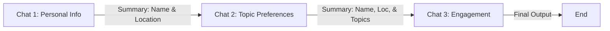

# Sequential Orchestration with AutoGen

Sequential Orchestration is a design pattern where agents are organized in a linear pipeline. Each agent processes a task or interaction in turn, and crucially, the **output or summary of one conversation becomes the context for the next**.

This pattern is ideal for workflows that require building up information step-by-step, such as customer onboarding, multi-stage data processing, or complex content generation.

## How It Works in This Project

In `sequential_chats.py`, we demonstrate a Customer Onboarding flow using three distinct stages. The "context" (information gathered) is passed like a baton from one agent to the next.

### The Three Stages

1.  **Stage 1: Profile Gathering**
    *   **Agent:** `Onboarding Personal Information Agent`
    *   **Goal:** Ask the user for their Name and Location.
    *   **Mechanism:** The agent chats with the user until the info is confirmed.
    *   **Handoff:** An LLM summarizes the chat into a clean JSON object (e.g., `{'name': 'Kiki', 'location': 'Edmonton'}`).

2.  **Stage 2: Preference Gathering**
    *   **Agent:** `Onboarding Topic Preference Agent`
    *   **Goal:** Ask what news topics the user likes.
    *   **Context:** This agent *starts* the conversation already knowing the user's name and location because the JSON summary from Stage 1 was injected into its context.
    *   **Handoff:** The LLM summarizes the new state (e.g., "Kiki from Edmonton likes Food and Tech").

3.  **Stage 3: Engagement**
    *   **Agent:** `Customer Engagement Agent`
    *   **Goal:** Provide fun content tailored to the user.
    *   **Context:** It receives the full rich context from Stage 2.
    *   **Result:** It generates a customized joke or story (e.g., a joke about robots eating pizza in Edmonton).

## Key Concepts

### 1. `initiate_chats`
This function is the engine that runs the sequence. It takes a list of chat definitions and executes them one by one.

### 2. Context Carrying (`summary_method`)
The magic happens via the `summary_method="reflection_with_llm"` setting.
*   Instead of passing the raw, messy chat transcript (which wastes tokens and confuses agents), AutoGen uses an LLM to "reflect" on the previous chat.
*   It generates a concise summary (defined by `summary_prompt`).
*   This clean summary is what is passed to the next agent.

### 3. Human Proxy (`customer_proxy_agent`)
*   Acts as **YOU**.
*   It has `human_input_mode="ALWAYS"`, meaning the script pauses and waits for you to type your answers in the terminal.
*   It has no "brain" (`llm_config=False`); it simply relays your typed text to the AI agents.
